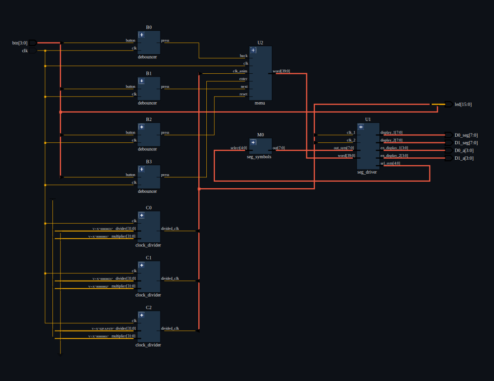
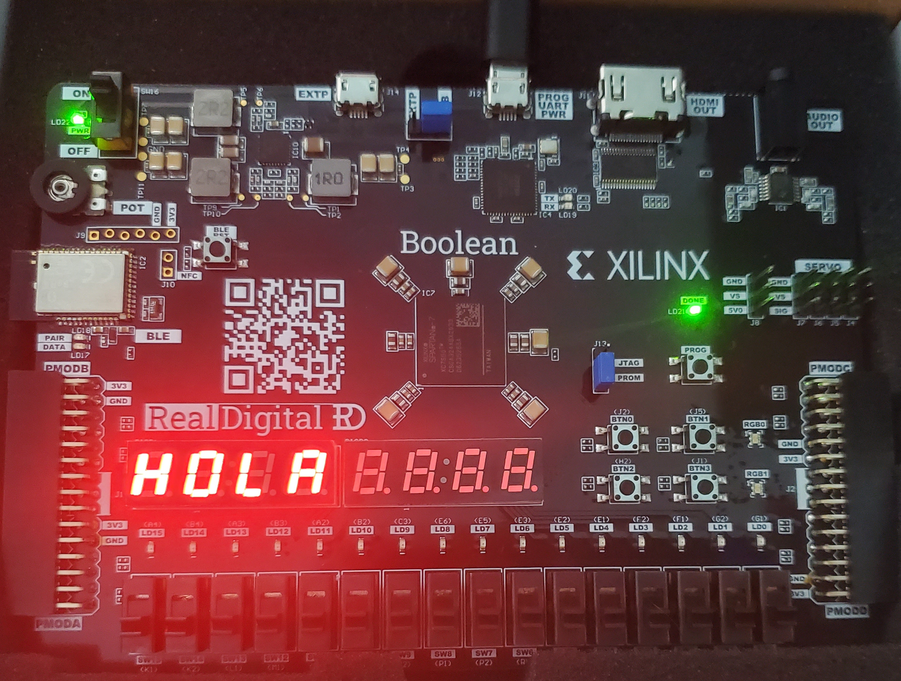

<h1>7-Segment Display Menu</h1>

<!-- GitHub Badges Section -->

  
  
  
  
     

<!-- Description -->

    <video loop src="https://github.com/user-attachments/assets/69d99929-987a-4a86-9bb0-7ccea29687d1"> 7-Segment Display Menu </video>   
    <b>Alphanumeric custom messages on 7-Segment Display Menu using Boolean Board</b> 
    <i>with integrated <code>8 x 7-segment displays</code> and <code>4 button</code> menu.</i>

## Key Features

* Dual clock synchronization
* Four-state display control logic
* Dynamic symbol selection and addressing
* Safe initialization avoiding undefined states
* Efficient right-to-left digit scanning

## RTL Netlist

## seg_driver Module

The **`seg_driver`** module features two clock signals for synchronization purposes and operates based on **four states**:

1. **Select symbol**
2. **Display symbol on screen**
3. **Change digit**
4. **Turn off the display**

## Overview

This module includes a **40-bit input** called `word` and an **8-bit input** called `out_sym`, which is connected to a **32-bit memory (M0)**.
Additionally, there is a **single 5-bit output** named `sel_sym`, which is also connected to memory **M0**.
This output acts as the **address** sent to the memory so that it can provide the corresponding word through the previously mentioned `out_sym` input.

## Logic Breakdown

The code logic can be divided into **four main parts**:

### 1. Initialize Variables

An `initial` statement assigns starting values to all registers, leaving the circuit in a known state — in this case, with the display **completely turned off**.
This ensures that no floating registers with ambiguous values exist, which could lead to **unknown (X)** or **high-impedance (Z)** states.

---

### 2. Select the Symbol

A `case` statement checks the state of the variable `sel_digit`, which indicates which digit of the two 4-digit 7-segment modules is currently active.
The corresponding **symbol** is then taken from the 40-bit `word` register.

For example:
If `sel_digit = 3`, the module will select the **fourth group of 5 bits** (bits **15 to 19**) from the `word`.
This group is used as the **address** sent to the 32-bit memory, which then provides the corresponding character via the `out_sym` output.

---

### 3. Display on Screen

Using the same `case` statement, the `sel_digit` variable determines which digit to display.
Depending on the selected digit, the symbol stored in memory (`out_sym`) is assigned and shown on screen.
Only **one digit** is turned on per cycle, and it is turned **off before the cycle ends**.

---

### 4. Change Digit

Conditional statements increment the `sel_digit` variable by **1** until it reaches its maximum value (**7**).
After that, it resets back to **0**.

This means the display performs a **right-to-left sweep**, updating the 7-segment display as many times as the combined period of both clocks allows.
In other words, the **display refreshes** at the same frequency as the **slowest clock**.

## Summary

| Signal      | Type     | Width   | Description                                    |
| :---------- | :------- | :------ | :--------------------------------------------- |
| `word`      | Input    | 40 bits | Input data containing encoded symbol addresses |
| `out_sym`   | Input    | 8 bits  | Symbol data retrieved from 32-bit memory (M0)  |
| `sel_sym`   | Output   | 5 bits  | Memory address used to fetch symbols           |
| `sel_digit` | Internal | 3 bits  | Current digit being displayed (0–7)            |

 

  
<i>Typical <code>Hello World</code> message displayed in Spanish</i>

## Mealy State Machine

